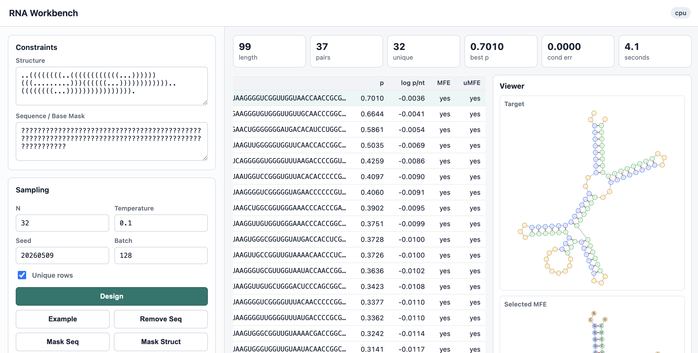

# RNA Workbench

RNA Workbench is a local browser app for RNA sequence design. It lets you enter secondary-structure and base constraints, generate candidate sequences with pretrained PyTorch checkpoints, score candidates with ViennaRNA, and inspect MFE/ensemble structures.



## What Is Included

```text
apps/rna_workbench/server.py         local HTTP/API server
apps/rna_workbench/static/           browser UI
trees/                               runtime model/source package
checkpoints/.gitkeep                 placeholder for downloaded model files
scripts/download_checkpoints.sh      checkpoint downloader and checksum verifier
requirements.txt                     pip dependencies
environment.yml                      conda environment
run_workbench.sh                     launch helper
screen.png                           UI screenshot
TECHNICAL_NOTES.md                   implementation notes
```

The pretrained checkpoint files are intentionally not stored in Git because they are large. Download them into `checkpoints/` before running the app.

## Quick Start

```bash
git clone https://github.com/quantumtative/GoForth.git
cd GoForth

python3.11 -m venv .venv
.venv/bin/python -m pip install --upgrade pip
.venv/bin/python -m pip install -r requirements.txt

RNA_WORKBENCH_RELEASE_BASE_URL=https://github.com/quantumtative/GoForth/releases/download/v0.1.0 \
  bash scripts/download_checkpoints.sh

RNA_WORKBENCH_PYTHON=.venv/bin/python \
RNA_WORKBENCH_DEVICE=cpu \
RNA_WORKBENCH_PORT=7861 \
  bash run_workbench.sh
```

Open:

```text
http://127.0.0.1:7861
```

Replace `v0.1.0` if you use a different release tag.

## Checkpoints

The app expects:

```text
checkpoints/full_structure_small.pt
checkpoints/fsb_partial_base_small.pt
```

Expected SHA256 hashes:

```text
a28e650ba0a8fd61a92ade424d939f3d95631df63f6f9f2ae78a5f81932b472f  checkpoints/full_structure_small.pt
38e7a884c26976e003c50fac290d7bf8d636fa13c645a348f47f9fe86a3de09d  checkpoints/fsb_partial_base_small.pt
```

Recommended distribution path:

1. Create a GitHub Release, for example `v0.1.0`.
2. Upload both `.pt` files as release assets.
3. Set `RNA_WORKBENCH_RELEASE_BASE_URL` to the release asset URL prefix.

Example release asset URLs:

```text
https://github.com/quantumtative/GoForth/releases/download/v0.1.0/full_structure_small.pt
https://github.com/quantumtative/GoForth/releases/download/v0.1.0/fsb_partial_base_small.pt
```

You can also override checkpoint paths directly:

```bash
RNA_WORKBENCH_FS_SMALL=/path/to/full_structure_small.pt \
RNA_WORKBENCH_FSB_SMALL=/path/to/fsb_partial_base_small.pt \
  bash run_workbench.sh
```

## Device Selection

```bash
RNA_WORKBENCH_DEVICE=auto  # CUDA if available, then MPS if available, otherwise CPU
RNA_WORKBENCH_DEVICE=cpu   # stable default
RNA_WORKBENCH_DEVICE=cuda
RNA_WORKBENCH_DEVICE=mps
```

For local use, `cpu` is the most predictable default. CUDA can be used on machines with a CUDA-enabled PyTorch install. Apple MPS support depends on the local macOS and PyTorch versions.

## Smoke Tests

After launching:

```bash
curl http://127.0.0.1:7861/api/status
```

The response should include both checkpoint choices:

```text
pretrained_small
fsb_pretrained_small
```

## Repository Notes

The `.gitignore` excludes local environments, generated outputs, screenshots, Python caches, and checkpoint binaries. Keep the checkpoint files in release assets or external model storage rather than committing them to Git.
